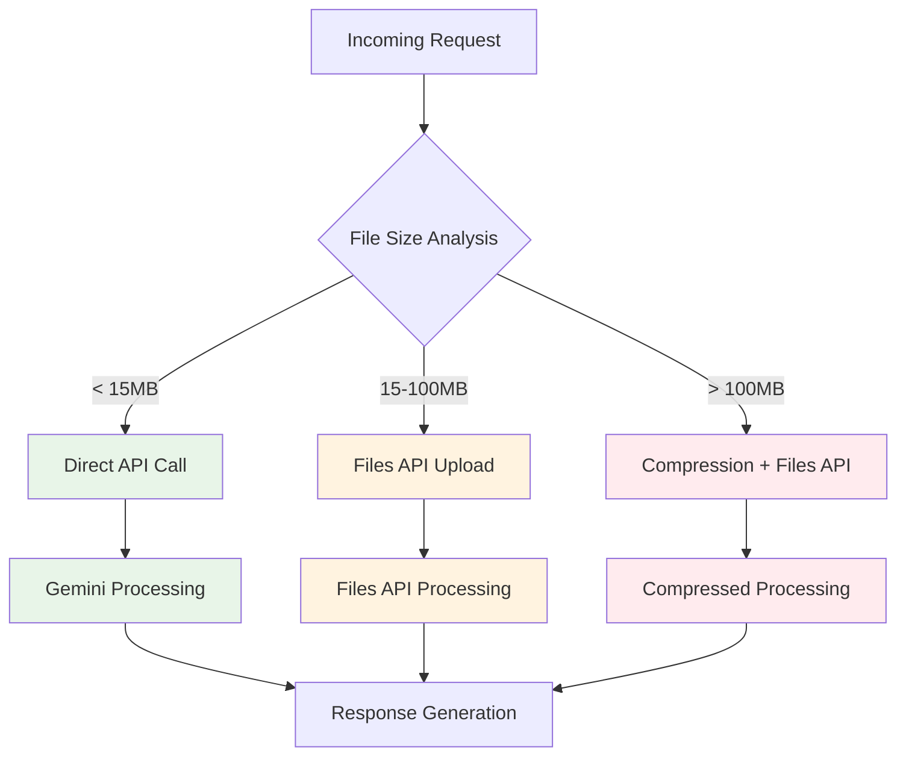

# Backend Server Documentation

## Overview

The alt-text-server repository provides the core AI processing capabilities for the Bluesky Alt Text Generator project. Built as an Express.js application optimized for Railway deployment, it serves as the central hub for all Google Gemini AI interactions and file processing logic.

## Architecture

### Core Components
- **Express.js Server**: HTTP server with CORS and security middleware
- **Google GenAI SDK**: Official @google/genai v1.12.0 integration
- **Specialized AI Instructions**: Content-type specific processing logic
- **Files API Integration**: Large file handling with automatic optimization
- **Railway Deployment**: Production hosting with health monitoring

### File Structure
```
alt-text-server/
├── index.js                 # Core processing logic (725 lines)
├── server.js                # Express server wrapper (175 lines)
├── package.json             # Dependencies and configuration
├── .env.example             # Environment template
├── .env                     # Local environment (gitignored)
├── README.md                # Deployment and usage guide
└── LICENSE                  # MIT license
```

## API Specification

### Primary Endpoint

**POST /generate-alt-text**

Central endpoint for all alt text and caption generation requests.

#### Request Format
```json
{
  "base64Data": "data:image/jpeg;base64,/9j/4AAQ...",
  "mimeType": "image/jpeg",
  "action": "generateAltText",
  "operation": "condense_text",
  "isVideo": true,
  "fileSize": 1048576
}
```

#### Request Parameters
- **base64Data** (required): Base64-encoded media file
- **mimeType** (required): Media MIME type (image/*, video/*)
- **action** (optional): Specific processing type
  - `"generateCaptions"`: VTT caption generation
  - `"generateAltText"`: Alt text generation (default)
- **operation** (optional): Special operations
  - `"condense_text"`: Text length optimization
- **isVideo** (optional): Force video processing mode
- **fileSize** (optional): Original file size for optimization

#### Response Format
```json
{
  "altText": "A photograph showing...",
  "processing": {
    "strategy": "files_api",
    "fileSize": 1048576,
    "compressionRatio": 0.65
  }
}
```

### Health Endpoint

**GET /health**

Railway deployment health monitoring endpoint.

```json
{
  "status": "healthy",
  "timestamp": "2025-01-20T10:30:00.000Z",
  "version": "1.0.0"
}
```

## AI Processing System

### Specialized Instruction Sets

The server uses content-aware AI instructions optimized for different media types:

#### 1. VTT Caption Generation
**Trigger**: `action === 'generateCaptions'`
**Purpose**: WebVTT-formatted video captions with precise timing

**Key Features**:
- Accurate timestamp formatting (HH:MM:SS.sss)
- Audio transcription and sound effect notation
- Subtitle length optimization for readability
- Proper WebVTT syntax compliance

**Example Output**:
```
WEBVTT

00:00:00.000 --> 00:00:03.500
Person walks into frame, looking around nervously.

00:00:03.500 --> 00:00:07.200
[Background music starts] They approach the door hesitantly.
```

#### 2. Still Image Alt Text
**Trigger**: Static images (JPEG, PNG, WebP)
**Purpose**: Concise, descriptive alt text for static images

**Key Features**:
- Clinical objectivity and accuracy
- Text transcription with quotation marks
- Brevity (aim for <150 characters when possible)
- Context-aware descriptions

#### 3. Animated Content Alt Text
**Trigger**: Animated GIFs, animated WebP, short videos treated as animations
**Purpose**: Complete sequence description for looping content

**Key Features**:
- Full animation cycle description
- Motion capture and sequence analysis
- Unified narrative approach
- Emphasis on complete action sequences

#### 4. Full Video Alt Text
**Trigger**: Standard video files with `isVideo=true`
**Purpose**: Comprehensive video content description

**Key Features**:
- Scene progression analysis
- Visual narrative description
- Key moment identification
- Comprehensive coverage of video content

#### 5. Video Frame Alt Text
**Trigger**: Single frames extracted from videos
**Purpose**: Best-effort description when full video processing isn't possible

**Key Features**:
- Detailed frame analysis
- Context inference from single frame
- Clear limitation acknowledgment
- Fallback processing strategy

#### 6. Text Condensation
**Trigger**: `operation === 'condense_text'`
**Purpose**: Length optimization while preserving meaning

**Key Features**:
- Intelligent summarization
- Length targeting based on requirements
- Essential meaning preservation
- Grammar and clarity maintenance

### Content Detection Logic

```javascript
function selectInstructionSet(mimeType, action, fileCharacteristics) {
  if (action === 'generateCaptions') {
    return VTT_CAPTION_INSTRUCTIONS;
  }
  
  if (mimeType.startsWith('image/')) {
    if (isAnimated(mimeType, fileCharacteristics)) {
      return ANIMATED_CONTENT_INSTRUCTIONS;
    }
    return STILL_IMAGE_INSTRUCTIONS;
  }
  
  if (mimeType.startsWith('video/')) {
    if (isShortAnimation(fileCharacteristics)) {
      return ANIMATED_CONTENT_INSTRUCTIONS;
    }
    return FULL_VIDEO_INSTRUCTIONS;
  }
  
  return DEFAULT_INSTRUCTIONS;
}
```

## File Processing Strategy

### Size-Based Processing Logic

The server implements intelligent file handling based on size and format:



### Files API Integration

**Purpose**: Handle large media files efficiently
**Implementation**: Google GenAI Files API with automatic fallbacks

```javascript
async function uploadToFilesAPI(base64Data, mimeType) {
  try {
    const buffer = Buffer.from(base64Data.split(',')[1], 'base64');
    
    const uploadResult = await genaiClient.files.upload({
      file: buffer,
      mimeType: mimeType
    });
    
    return {
      success: true,
      fileUri: uploadResult.file.uri,
      fileSize: buffer.length
    };
  } catch (error) {
    return { success: false, error: error.message };
  }
}
```

### Compression Strategy

When files exceed optimal sizes, the server implements compression logic:

1. **Quality Reduction**: Progressive quality degradation
2. **Resolution Scaling**: Intelligent downscaling for large videos
3. **Format Optimization**: Codec selection based on content type
4. **Bitrate Management**: Adaptive bitrate selection

```javascript
function calculateCompressionRatio(originalSize, targetSize) {
  if (originalSize > 50 * 1024 * 1024) { // 50MB+
    return 0.3; // Aggressive compression
  } else if (originalSize > 20 * 1024 * 1024) { // 20-50MB
    return 0.5; // Moderate compression
  } else {
    return 0.7; // Light compression
  }
}
```

## Configuration & Deployment

### Environment Variables

```bash
# Required
GEMINI_API_KEY=your_actual_api_key_here

# Optional
PORT=3000
NODE_ENV=production
```

### Railway Deployment

The server is optimized for Railway deployment with automatic configuration:

#### `package.json` Configuration:
```json
{
  "scripts": {
    "start": "node server.js",
    "dev": "nodemon server.js"
  },
  "engines": {
    "node": "20"
  }
}
```

#### Health Check Configuration:
- **Path**: `/health`
- **Expected Response**: 200 OK with JSON status
- **Timeout**: 30 seconds
- **Interval**: 60 seconds

### Server Configuration

```javascript
// Core Express configuration
const app = express();
const port = process.env.PORT || 3000;

// Security middleware
app.use(cors({
  origin: [
    'https://alttext.symm.app',
    'https://bsky.app',
    'chrome-extension://*'
  ],
  credentials: true
}));

app.use(express.json({ limit: '50mb' }));
app.use(express.urlencoded({ limit: '50mb', extended: true }));
```

## Error Handling

### Comprehensive Error Management

The server implements multi-layer error handling:

#### 1. Request Validation
```javascript
function validateRequest(req) {
  if (!req.body.base64Data) {
    throw new ValidationError('Missing base64Data parameter');
  }
  if (!req.body.mimeType) {
    throw new ValidationError('Missing mimeType parameter');
  }
  return true;
}
```

#### 2. API Error Handling
```javascript
async function handleGeminiError(error) {
  if (error.code === 'PERMISSION_DENIED') {
    return { error: 'API key invalid or expired' };
  }
  if (error.code === 'QUOTA_EXCEEDED') {
    return { error: 'API quota exceeded, please try again later' };
  }
  return { error: 'AI processing failed, please try again' };
}
```

#### 3. Fallback Strategies
- **Files API Failure**: Automatic fallback to compression
- **Compression Failure**: Fallback to direct upload with warnings
- **AI Processing Failure**: Graceful error messages with retry suggestions

### Error Response Format

```json
{
  "error": "User-friendly error message",
  "details": {
    "code": "PROCESSING_FAILED",
    "originalError": "Technical error details",
    "suggestion": "Try reducing file size or using a different format"
  },
  "timestamp": "2025-01-20T10:30:00.000Z"
}
```

## Performance Optimization

### Caching Strategy

```javascript
// Response caching for repeated requests
const responseCache = new Map();

function generateCacheKey(base64Data, mimeType) {
  return crypto.createHash('sha256')
    .update(base64Data + mimeType)
    .digest('hex');
}
```

### Memory Management

```javascript
// Automatic cleanup for large file processing
function cleanupLargeFileProcessing(fileUri) {
  setTimeout(async () => {
    try {
      await genaiClient.files.delete(fileUri);
    } catch (error) {
      console.warn('Cleanup failed:', error.message);
    }
  }, 300000); // 5 minutes
}
```

### Request Optimization

- **Concurrent Request Limiting**: Prevents server overload
- **Request Size Validation**: Early rejection of oversized requests
- **Timeout Management**: Prevents hanging requests

## Monitoring & Logging

### Production Logging

```javascript
// Structured logging for production
function logRequest(req, res, processingTime) {
  console.log({
    timestamp: new Date().toISOString(),
    method: req.method,
    path: req.path,
    mimeType: req.body.mimeType,
    fileSize: req.body.base64Data?.length || 0,
    processingTime: processingTime,
    status: res.statusCode
  });
}
```

### Railway Monitoring

- **Health Checks**: Automatic uptime monitoring
- **Log Aggregation**: Centralized logging and error tracking
- **Performance Metrics**: Response time and throughput monitoring

## Security Considerations

### API Key Security
- Environment variable storage
- No hardcoded credentials
- Secure transmission (HTTPS only)

### Request Validation
- File size limits to prevent abuse
- MIME type validation
- Base64 format verification

### CORS Security
- Restricted origin list
- Credential handling
- Preflight request management

---

*Backend Server Documentation Version: 1.0 | Last Updated: January 2025*