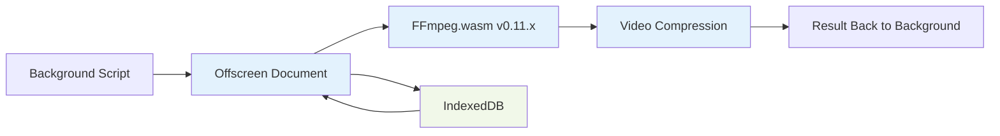

# Browser Extension Documentation

## Overview

The alt-text-ext repository contains a sophisticated cross-browser extension built using the WXT.dev framework. The extension provides seamless alt text generation directly within the Bluesky social media platform, featuring advanced video processing capabilities and cross-platform compatibility.

## Architecture

### Framework & Build System
- **Framework**: WXT.dev v0.20.6 for cross-browser compatibility
- **Manifest**: V3 (Chrome/Edge), with MV2 fallback for Firefox store version
- **Build Target**: Unified build supporting Chrome, Firefox, and Safari
- **TypeScript**: Full type safety with @types/chrome and @types/webextension-polyfill

### Project Structure
```
alt-text-ext/
├── entrypoints/                    # Extension entry points
│   ├── background.ts              # Service worker (972 lines)
│   ├── bsky_alt_generator.content.ts  # Content script (1103 lines)
│   ├── content.ts                 # Content script router
│   └── popup/                     # Extension popup UI
├── lib/                           # Shared libraries
│   └── video-processing.ts        # Video processing utilities (268 lines)
├── public/                        # Static assets
│   ├── assets/                    # FFmpeg and UI assets
│   ├── icons/                     # Extension icons
│   ├── offscreen-ffmpeg-handler.js    # FFmpeg integration (397 lines)
│   ├── video-processing-web.js    # Shared video processing (500 lines)
│   ├── offscreen-loader.js        # Offscreen document loader (176 lines)
│   └── offscreen.html             # Offscreen document template
├── wxt.config.ts                  # WXT configuration (135 lines)
├── package.json                   # Dependencies and scripts
└── tsconfig.json                  # TypeScript configuration
```

## Core Components

### 1. Background Service Worker (background.ts)

**Purpose**: Central coordinator for all extension functionality
**Key Features**:
- API communication with alt-text-server
- Context menu management for right-click functionality
- Offscreen document lifecycle management for video processing
- Error handling and user feedback coordination

**Critical Functions**:
```typescript
// API communication
generateAltTextProxy(base64Data: string, mimeType: string): Promise<string>

// Video processing coordination
compressVideoWithOffscreen(file: File): Promise<CompressedVideo>

// Error handling
handleApiError(error: any): UserFriendlyErrorMessage
```

### 2. Content Script (bsky_alt_generator.content.ts)

**Purpose**: DOM manipulation and UI integration with Bluesky
**Key Features**:
- Automatic detection of alt text input fields
- ✨ button injection next to text areas
- Real-time UI feedback during processing
- Toast notification system for user feedback

**UI Integration Points**:
- Alt text input field detection: `textarea[placeholder*="alt text"]`
- Button injection with Bluesky design consistency
- Loading states and progress indicators
- Error handling with user-friendly messages

### 3. Video Processing System

#### Offscreen Document Architecture
The extension uses Chrome's offscreen document API to isolate heavy video processing:



#### Compression Strategy
The extension implements sophisticated compression logic:

1. **File Size Analysis**:
   - < 15MB: Direct upload without compression
   - 15-80MB: Standard compression with quality settings
   - > 80MB: IndexedDB transfer to overcome Chrome message limits

2. **Codec Selection**:
   - **H.264**: Default for broad compatibility
   - **VP8**: WebM format for smaller files
   - **VP9**: Advanced compression for large files

3. **Quality Settings**:
   - **High**: CRF 22, veryfast preset
   - **Medium**: CRF 26, veryfast preset  
   - **Low**: CRF 30, ultrafast preset

4. **Adaptive Processing**:
   - FPS capping to 30fps for high framerate videos
   - Resolution limiting to 1280x720 for very large files
   - Progressive quality reduction for stubborn files

## Technical Implementation

### FFmpeg Integration

**Version**: @ffmpeg/ffmpeg v0.11.0 and @ffmpeg/core v0.11.0
**Why v0.11.x**: Chrome Manifest V3 compatibility requirements

**Key Configuration**:
```javascript
const ffmpeg = createFFmpeg({
  corePath: './assets/ffmpeg/ffmpeg-core.js',
  wasmPath: './assets/ffmpeg/ffmpeg-core.wasm',
  workerPath: './assets/ffmpeg/ffmpeg-core.worker.js'
});
```

**Critical Commands**:
```bash
# High quality H.264 compression
-c:v libx264 -crf 22 -preset veryfast -c:a aac -b:a 128k
-vf scale=trunc(iw/2/2)*2:trunc(ih/2/2)*2 -movflags +faststart

# VP9 for advanced compression  
-c:v libvpx-vp9 -crf 30 -deadline realtime -row-mt 1
-c:a libopus -b:a 96k
```

### Large File Handling

**Problem**: Chrome extension message passing has size limitations (~64MB)
**Solution**: IndexedDB intermediate storage

**Implementation**:
1. Background script stores large file in IndexedDB
2. Passes storage key to offscreen document via message
3. Offscreen document retrieves file from IndexedDB
4. Processes file and stores result back in IndexedDB
5. Background script retrieves and cleans up storage

### Cross-Browser Compatibility

**WXT Configuration**:
```typescript
// Automatic browser detection and adaptation
manifest: ({ browser, manifestVersion }) => ({
  ...(browser === 'firefox' && {
    browser_specific_settings: {
      gecko: { id: '{bf28fcb2-7a85-44b3-add7-7a47fdd9a4a4}' }
    }
  })
})
```

**Build Commands**:
```bash
# Chrome (default)
npm run build:chrome

# Firefox
npm run build:firefox  

# Safari
npm run build:safari

# Unified build
npm run build:unified
```

## Configuration & Deployment

### Environment Variables
- `VITE_CLOUD_FUNCTION_URL`: Backend API endpoint
- Build-time injection via WXT vite configuration

### Content Security Policy
```typescript
content_security_policy: {
  extension_pages: "script-src 'self' 'wasm-unsafe-eval'; object-src 'self'; worker-src 'self';"
}
```

### Permissions
```typescript
permissions: [
  'storage',      // Extension settings
  'activeTab',    // Current tab access  
  'scripting',    // Content script injection
  'contextMenus', // Right-click menus
  'offscreen'     // Offscreen document access
],
host_permissions: [
  '*://*.bsky.app/*',           // Bluesky integration
  '*://*.deer.social/*',        // Alternative Bluesky instance
  'https://us-central1-symm-gemini.cloudfunctions.net/*'  // API access
]
```

## Development Workflow

### Local Development
```bash
# Start development server
npm run dev:chrome    # Chrome with hot reload
npm run dev:firefox   # Firefox with hot reload
npm run dev:safari    # Safari with hot reload

# Type checking
npm run compile
```

### Building & Packaging
```bash
# Build for production
npm run build:chrome
npm run build:firefox
npm run build:safari

# Create distribution packages
npm run zip:chrome
npm run zip:firefox
npm run package:unified

# Complete build and package
npm run package:all
```

### Testing Strategy
- **Manual Testing**: Load unpacked extension in browser developer mode
- **Playwright Integration**: Automated testing with @playwright/test
- **Cross-browser Testing**: WXT dev server supports hot reload across browsers

## Performance Considerations

### Memory Management
- **FFmpeg Cleanup**: Explicit ffmpeg.exit() after processing
- **IndexedDB Cleanup**: Automatic cleanup of temporary storage
- **Event Listener Management**: Proper cleanup in content scripts

### Processing Optimization
- **Web Worker Isolation**: Prevents main thread blocking
- **Progressive Quality**: Automatic quality reduction for problematic files
- **Timeout Handling**: Prevents infinite processing loops

### User Experience
- **Loading Indicators**: Real-time feedback during processing
- **Error Recovery**: Graceful fallbacks for compression failures
- **Toast Notifications**: Clear success/error messaging

## Known Issues & Solutions

### Fixed Issues (in development v1.0.0):
1. **Large File Truncation**: Fixed via IndexedDB transfer system
2. **High FPS Video Hanging**: Fixed with adaptive FPS capping
3. **Format Detection Errors**: Fixed with explicit format specification
4. **pthread Warnings**: Mitigated with thread limiting configuration

### Current Issues:
1. **Store Version Gap**: Development v1.0.0 vs published v0.3.1
2. **GIF Processing Regression**: Under investigation
3. **VTT Formatting Reliability**: Requires enhanced validation

### Browser-Specific Considerations:
- **Chrome**: Full feature support, primary development target
- **Firefox**: MV2 compatibility layer for store version
- **Safari**: Limited testing, requires additional validation

## API Integration

### Backend Communication
```typescript
interface APIRequest {
  base64Data: string;
  mimeType: string;
  action?: 'generateCaptions' | 'generateAltText';
  operation?: 'condense_text';
}

interface APIResponse {
  altText?: string;
  captions?: string;
  error?: string;
}
```

### Error Handling
- **Network Errors**: Retry logic with exponential backoff
- **API Errors**: User-friendly error messages
- **Processing Errors**: Fallback to original file upload

---

*Documentation Version: 1.0 | Last Updated: January 2025*