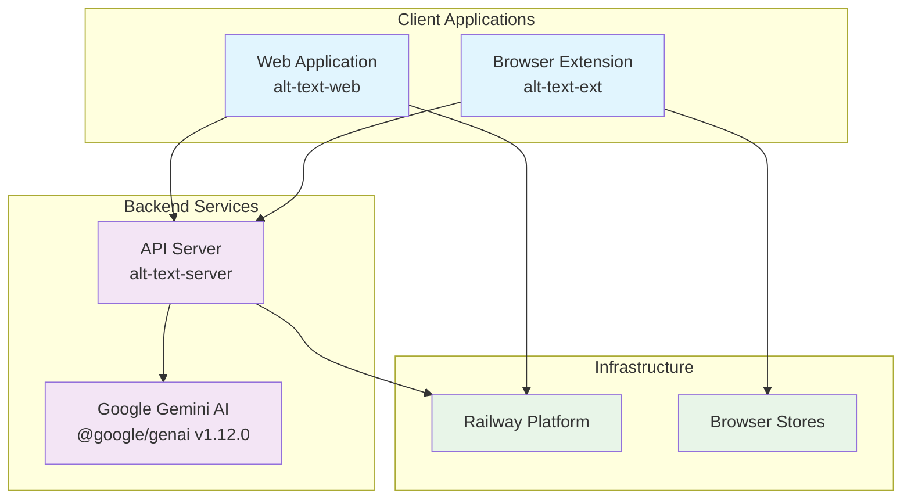
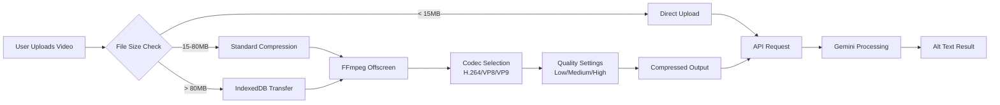
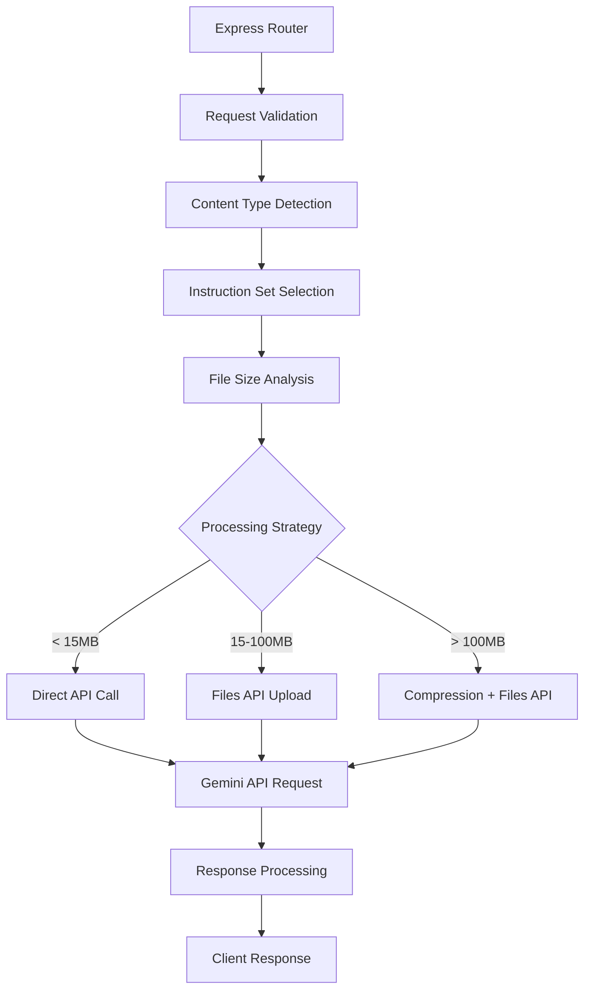
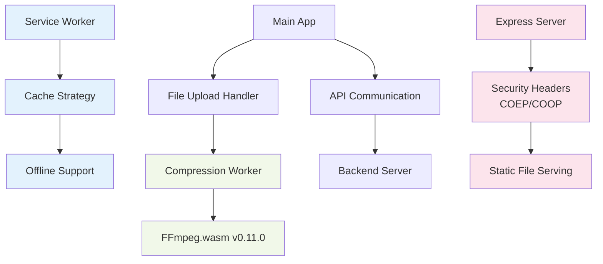

# Technical Architecture Overview

## System Architecture

The Bluesky Alt Text Generator is built as a distributed system with four main components working together to provide AI-powered alt text generation. The architecture emphasizes modularity, scalability, and cross-platform compatibility.



## Component Architecture

### 1. Browser Extension (alt-text-ext)

**Framework**: WXT.dev for cross-browser compatibility  
**Architecture**: Manifest V3 with service worker pattern  
**Version**: 1.0.0 (development), 0.3.1 (published stores)

#### Core Components:
- **Background Service Worker** (`background.ts`): Main controller, API communication
- **Content Scripts** (`bsky_alt_generator.content.ts`): DOM manipulation, UI injection
- **Offscreen Document**: FFmpeg video processing in isolated context
- **Popup Interface**: Extension settings and information

#### Video Processing Pipeline:


#### Key Technologies:
- **FFmpeg.wasm v0.11.x**: Video compression with multi-codec support
- **IndexedDB**: Large file handling for Chrome message size limits
- **WebExtension Polyfill**: Cross-browser API compatibility
- **TypeScript**: Type-safe development

### 2. Backend Server (alt-text-server)

**Framework**: Express.js  
**Deployment**: Railway Platform  
**AI Integration**: @google/genai v1.12.0 (latest Google GenAI SDK)

#### Architecture Layers:


#### Specialized AI Instruction Sets:
1. **VTT Caption Generation**: WebVTT-formatted video captions
2. **Still Image Alt Text**: Optimized for photographs and static images
3. **Animated Content**: Specialized for GIFs and short animations
4. **Full Video Alt Text**: Comprehensive video descriptions
5. **Video Frame Alt Text**: Single frame analysis with context
6. **Text Condensation**: Length optimization while preserving meaning

#### Advanced Features:
- **Smart Content Detection**: Automatic instruction set selection
- **Files API Integration**: Handles large files efficiently
- **Compression Fallbacks**: Multiple strategies for file size optimization
- **CORS Management**: Secure cross-origin requests
- **Health Monitoring**: Railway deployment health checks

### 3. Web Application (alt-text-web)

**Architecture**: Progressive Web App (PWA)  
**Server**: Express.js with security headers  
**Deployment**: Railway Platform  
**Frontend**: Vanilla JavaScript ES6+ with Web Workers

#### PWA Architecture:


#### Core Features:
- **Drag & Drop Interface**: Intuitive file upload
- **Real-time Compression Logs**: User feedback during processing
- **Web Worker Processing**: Non-blocking video compression
- **Cross-Origin Security**: Proper COEP/COOP headers for SharedArrayBuffer
- **Mobile Responsive**: Touch-friendly interface

### 4. Main Repository (gen-alt-text)

**Purpose**: Central coordination and documentation hub  
**Content**: Project assets, documentation, release coordination

## Data Flow Architecture

### 1. Extension Workflow:
```
User Action (Bluesky) → Content Script → Background Service → 
Offscreen Processing → API Request → Gemini Processing → 
Response → UI Update → User Review
```

### 2. Web App Workflow:
```
File Upload → Compression Worker → API Request → 
Gemini Processing → Response → Result Display → Copy to Clipboard
```

### 3. API Processing Pipeline:
```
Request Validation → Content Analysis → Instruction Selection → 
File Size Strategy → Gemini API Call → Response Processing → 
Client Response
```

## Security Architecture

### Authentication & Authorization:
- **API Key Management**: Secure environment variable storage
- **CORS Policy**: Restricted origin access
- **Request Validation**: Input sanitization and validation

### Content Security:
- **CSP Headers**: Strict content security policies
- **File Size Limits**: Graduated limits with compression
- **Rate Limiting**: API request throttling

### Privacy Protection:
- **No Data Persistence**: Temporary processing only
- **Client-side Processing**: Video compression happens locally
- **Secure Transmission**: HTTPS-only communication

## Performance Architecture

### Optimization Strategies:
1. **Client-side Compression**: Reduces bandwidth usage
2. **Adaptive Quality Settings**: Balance quality vs. size
3. **Parallel Processing**: Web Workers prevent UI blocking
4. **Caching Strategies**: PWA caching for offline capability
5. **CDN-free Architecture**: Local asset hosting for reliability

### Scalability Considerations:
- **Stateless Design**: Horizontal scaling capability
- **Railway Auto-scaling**: Platform-level scaling
- **Resource Optimization**: Memory and CPU efficient processing

## Technology Stack Summary

| Component | Primary Tech | Key Libraries | Version |
|-----------|-------------|---------------|---------|
| Extension | TypeScript, WXT | @ffmpeg/ffmpeg v0.11.x | 1.0.0 |
| Backend | Node.js, Express | @google/genai v1.12.0 | 1.0.0 |
| Web App | JavaScript ES6+, PWA | FFmpeg.wasm v0.11.0 | 1.0.0 |
| Deployment | Railway | Express servers | Latest |

## Integration Points

### External APIs:
- **Google Gemini API**: AI processing via @google/genai SDK
- **Railway Platform**: Hosting and deployment
- **Browser Extension Stores**: Chrome Web Store, Firefox Add-ons

### Internal APIs:
- **Unified Backend API**: Single endpoint for all clients
- **WebExtension APIs**: Chrome/Firefox extension capabilities
- **Web APIs**: File API, Web Workers, Service Workers

---

*Architecture Version: 1.0 | Last Updated: January 2025*